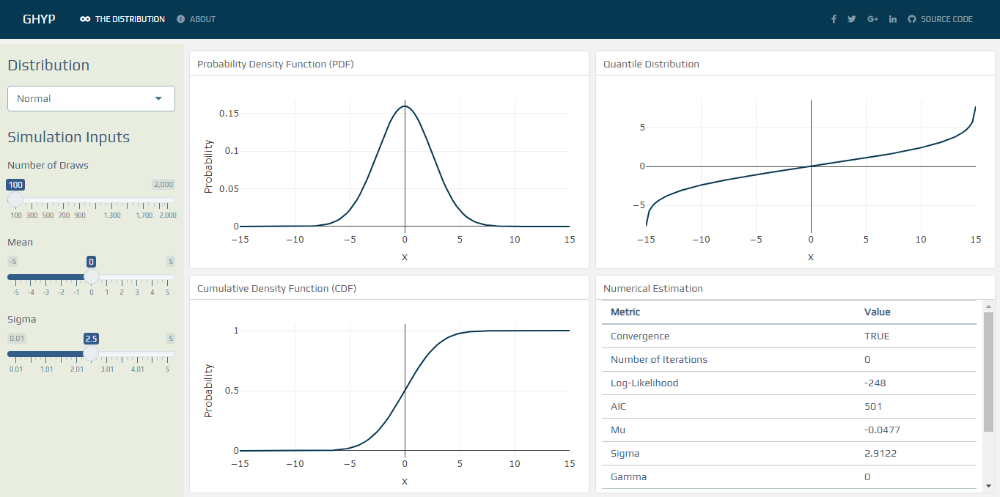

<!-- README.md is generated from README.Rmd. Please edit that file -->

```{r, include = FALSE}
knitr::opts_chunk$set(
  collapse = TRUE,
  comment = "#>"
)
```

# SimGHYP

The Generalized Hyperbolic Distribution is a very flexible density with many usages in finance. Unfortunately, this flexibility comes with a price: five parameters have to be estimated, which can make it hard to distinguish between their marginal impact.

This dashboard aims to make GHYP more intuitive and, hopefully, more fun!


